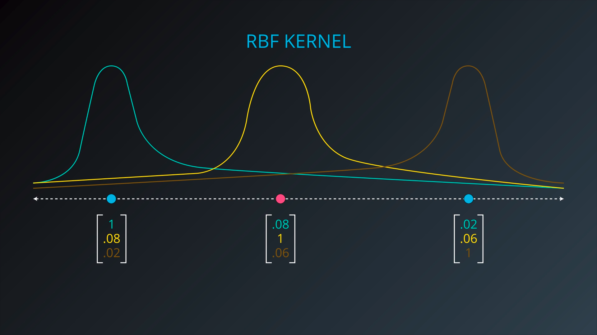
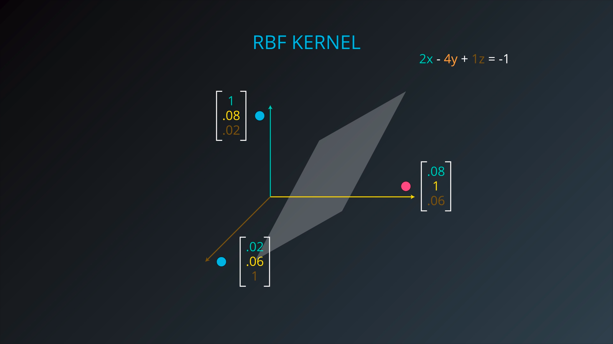
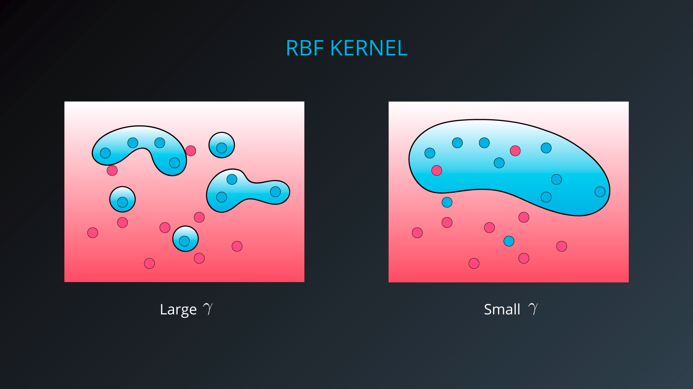

## Support Vector Machines

SVMs attempts to maximize the distance from the linear boundary to the closest points (called the support vectors).

SVMs can be implemented in three different ways:

1. Maximum Margin Classifier

   - linear version for separable data

   - ```python
     from sklearn.svm import LinearSVC
     svc = LinearSVC(C=1.0)
     ```
2. Classification with Inseparable Classes

   - C parameter to tune
3. Kernel Methods
   - nonlinear boundaries
   - C parameter to tune
   - Two types: 
     - polynomial: Tune `degree`
     - rbf: Tune `gamma`

#### Maximum Margin Classifier

When your data can be completely separated, the linear version of SVMs attempts to maximize the distance from the linear boundary to the closest points (called the support vectors)

#### Classification with Inseparable Classes

- Cost Function (Error): Classification Error + Margin Error (same as L2 regularization term)

- Margin Error: Max separation/Margin between classes 

- _C parameter_: __C__*classification Error + Margin Error

  Shows our tolerance to false-detection

  - Small C -> Large margin but makes some classification errors
  - Large C -> Well classified points but may have a small margin
  - Ranges between 0 and infinity

#### Kernel methods

Kernels in SVMs allow us the ability to separate data when the boundary between them is nonlinear. 

feature mapping: maps from attributes to features. e.g., $\phi(x)=[x,x^2,x^3]$

- _Polynomial kernel_: include the polynomial combination of attributes (original inputs) ($x, y$) which increases the dimension of the problem but may solve it (adding $x^2, y^2, xy$ features for second degree). 

  - _Note_: The degree of polynomial is a hyper-parameter 

- __RBF Kernel__: Radial Basis Function which puts a pseudo-normal distribution (without normalizing term) times a coefficient (figures below) on top of each sample point (feature mapping is a density function, based on the squared Euclidean distance between two data points) and add them up, so it can separate the classes, and the classification region is the union of these ellipse-like kernels.

- $$
  RBF(x,x') = \exp(-\frac{||x-x'||^2}{2\sigma^2}) 
  $$

- 

- 




- __$\gamma$ Parameter__ : 
  $$
  \gamma = \frac{1}{2\sigma^2}
  $$


where $\sigma$ is the standard deviation of the normal distribution function (RBF kernel) 

_Note_: in higher dimensions the formula for this parameter becomes more complicated but the concept remains the same




#### SVM in sklearn

```python
from sklearn.svm import SVC
model = SVC()
model.fit(x_values, y_values)
# View support vectors
model.support_vectors_
# View indices of support vectors
model.support_
# View number of support vectors for each class
model.n_support_
```

Hyper-parameters:

- `C`: The C parameter. Importance of misclassification
- `kernel`: The kernel. The most common ones are 'linear', 'poly', and 'rbf'.
- `degree`: If the kernel is polynomial, this is the maximum degree of the monomials in the kernel.
- `gamma` : If the kernel is rbf, this is the gamma parameter.

#### Calibrate Predicted Probabilities In SVC

SVC’s use of a hyperplane to create decision regions do not naturally output a probability estimate that an observation is a member of a certain class. However, we can in fact output calibrated class probabilities with a few caveats. In an SVC, **Platt scaling** can be used, wherein first the SVC is trained, then a separate cross-validated logistic regression is trained to map the SVC outputs into probabilities

```python
# Create support vector classifier object
svc = SVC(kernel='linear', probability=True)
```

#### Imbalanced Classes In SVM

In support vector machines, C
is a hyperparameter determining the penalty for misclassifying an observation. One method for handling imbalanced classes in support vector machines is to weight C by classes  (a weight inversely proportional to class's frequency)

```python
# Create support vector classifier
svc = SVC(kernel='linear', class_weight='balanced', C=1.0)
```


