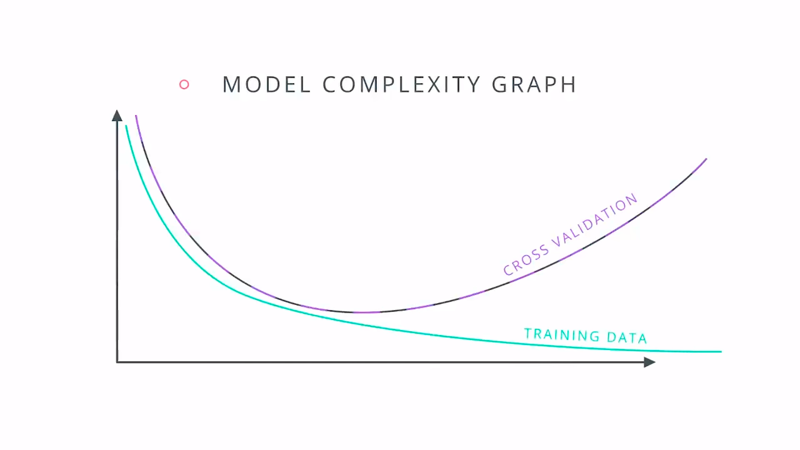
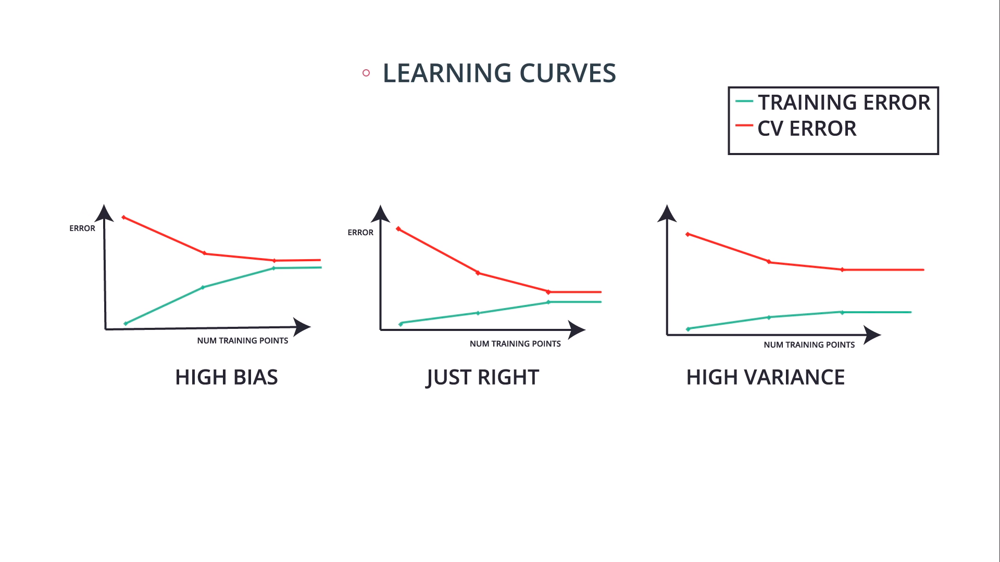

## Training and Tuning

Underfitting: 

* Oversimplified
* Does not do well on training set
* Error due to high bias

Overfitting:

* Overcomplicated
* Good on training but memorizing instead of learning
* Error due to high variance

**Cross Validation (CV)**: use a validation set to find the best fit and not overfit or underfit

**Grid Search** can be used to find the best values (hyper-parameters) of a classifier based on Cross Validation

```python
from sklearn.tree import DecisionTreeClassifier

from sklearn.model_selection import GridSearchCV
from sklearn.metrics import make_scorer
from sklearn.metrics import f1_score

#Make an f1_score scoring object.
scorer = make_scorer(f1_score)

#Create the Classifier Object
clf = DecisionTreeClassifier()

#Create the parameters list you wish to tune.
parameters = {'max_depth':list(range(1,20)), 'min_samples_leaf':list(range(1,20)), 'min_samples_split':list(range(2,20))}

# Perform grid search on the classifier using 'scorer' as the scoring method.
grid_obj = GridSearchCV(clf, parameters, scoring=scorer)

# Fit the grid search object to the training data and find the optimal parameters.
grid_fit = grid_obj.fit(X_train,y_train)

# Get the estimator.
best_clf = grid_fit.best_estimator_
```

It can often be difficult (and extremely time consuming) to test all the possible hyperparameter combinations to find the best models (Grid Search). Therefore, it is often useful to set up a **Randomized Search**.

```python
from sklearn.model_selection import train_test_split, RandomizedSearchCV

# Set up the hyperparameter search (RandomForest)
param_dist = {"max_depth": [3, None],
              "n_estimators": list(range(10, 200)),
              "max_features": list(range(1, X_test.shape[1]+1)),
              "min_samples_split": list(range(2, 11)),
              "min_samples_leaf": list(range(1, 11)),
              "bootstrap": [True, False],
              "criterion": ["gini", "entropy"]}

random_search = RandomizedSearchCV(clf,param_distributions=param_dist)

```

---

Plot the training curve along with cross validation curve (__model complexity graph__) and find the closest point



**K-fold Cross Validation**: divide to K groups and keep one out for validation, repeat for all K groups (better to shuffle the data)

**Learning Curve**:



