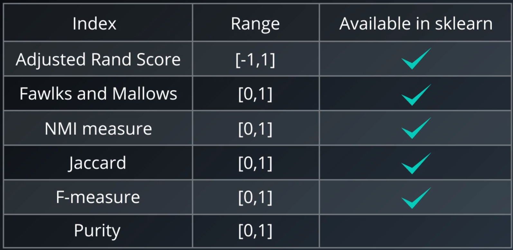

## Gaussian Mixture Models (GMMs) Clustering 

Soft clustering algorithm: Every sample point belong to every cluster with different weights

---

#### Expectation-Maximization for Gaussian Mixtures:

1. Initialize K Gaussian Distributions:  Initialize means and standard deviations. 

   1. Naive method: Use the mean and std of the dataset
   2. Random method: Use random initial values
   3. Better method: Run K-means and use those clusters as initial values

2. Soft-Cluster the data - "Expectation": Calculate membership value of each point to each cluster

   1. $$
      E[Z_{iA}] = \frac{N(X_i|\mu_A,\sigma^2_A)}{N(X_i|\mu_A,\sigma^2_A) + N(X_i|\mu_B,\sigma^2_B)}
      $$


  Expectation of latent variable ( Z ) belonging to cluster A : E[Z_{1A}] 

3. Re-estimate the Gaussian distributions - "Maximization": using membership values of previous step and calculate new parameters for the Gaussian clusters

   1. Calculate the weighted average for new mean:
      $$
      \mu_A^{new} = \frac{\sum_{i=1}^N E[Z_{iA}]X_i}{\sum_{i=1}^N E[Z_{iA}]}
      $$

   2. Calculate the wighted variance for few std:
      $$
      \sigma_A^2 = \frac{\sum_{i=1}^N E[Z_{iA}](X_i-\mu_A^{new})(X_i-\mu_A^{new})^T}{\sum_{i=1}^N E[Z_{iA}]}
      $$

4. Evaluate log-likelihood to check for convergence: The higher the value of log-likelihood, the better the fit is to the data.

   1. $$
      \ln p(X|\mu,\sigma^2) = \sum_{i=1}^N \ln(\sum_{k=1}^K \pi_k N(X_i|\mu_k,\sigma_k^2))
      $$

      Sum over all points ( $N$ ) and for all clusters ( $K$ )

   2. $\pi_k$ is the mixing coefficient (contribution of each cluster)

5. Repeat Step 2 to 4 until convergence


_Note_: Initialization and covariance_type significantly affect the performance.

#### GMM in sklearn

```python
from sklearn.mixture import GaussianMixture
gmm = GaussianMixture(n_components=3) #number of kernels
gmm.fit(data)
preds = gmm.predict(data)
```

__Advantages__:

- Soft-Clustering (membership of multiple clusters)
- Flexible cluster shapes (even with one inside another)

__Disadvantages__:

- Sensitive to initialization values
- Can converge to local optimum
- Slow convergence rate

---

## Cluster Analysis


---

## Cluster Validation

procedure of objectively and quantitatively evaluating the result of a clustering method.

Categories of cluster validation indices:

- External indices: use labels (if already exists) to evaluate

  

  ARI (Adjusted Rand Index) [0, 1]: [link](http://faculty.washington.edu/kayee/pca/supp.pdf)  and  [Wikipedia](https://en.wikipedia.org/wiki/Rand_index)

  

  

```python
from sklearn.metrics.cluster import adjusted_rand_score
#from sklearn.metrics import adjusted_rand_score

ar_score = adjusted_rand_score(target, preds)
```


- Internal indices: (No labels are available - unsupervised learning) measure the fit between data and structure using only the data

  

  Silhouette index:

  

  

  

  

  DBCV: Density Based Clustering validation (for methods such as DBSCAN)

- Relative Indices: Compare two clustering structures

  - Compactness: how close the elements of a cluster are to each other
  - Separability: how far are clusters are from each other

