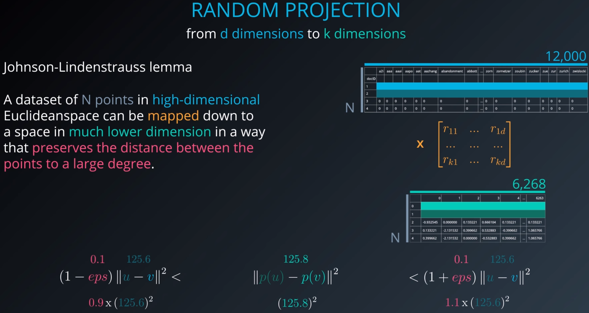

## Random Projection

A dimensionality reduction method similar to PCA but with random new  `k`  projection components.



Better computational performance.

```python
from sklearn.random_projection import SparseRandomProjection
new_X = SparseRandomProjection().fit_transform(X)
```

---

## Independent Component Analysis

ICA assumes that features are mixture of independent sources (so it tries to isolate/retrieve original sources/signals). 

It can solve the __blind source separation__ problem.

*reference*: "[Independent component analysis: algorithms and applications](http://citeseerx.ist.psu.edu/viewdoc/download?doi=10.1.1.322.679&rep=rep1&type=pdf)" (pdf)

$X=A \times S$ where X is the dataset, A is the mixing matrix and S is the source signals. Therefore, $S=W \times X$ where $W=A^{-1}$ 

**FastICA algorithms**:

*Assumptions*:

- Components are statistically independent

- Components must have **non-Gaussian distribution**

*Idea*: The Central Limit Theorem, tells that the distribution of a sum of independent random variables tends toward a Gaussian distribution. Thus, a sum of two independent random variables usually has a distribution that is closer to Gaussian than any of the two original random variables.

*Steps*:

1. Center and Whiten the data, $X$

   1. Whitening: transform $X$ linearly so that new vector $\hat{X}$ components are uncorrelated and their variances equal unity. In other words, the covariance matrix of $\hat{X}$ equals the identity matrix: $E[\hat{X}\hat{X}^T]=I$. One popular method is Eigenvalue Decomposition (EVD)

2. Choose initial random weight matrix $W = w_1, w_2, \dots, w_n$

3. Estimate $W$, containing vectors $w_i$

   1. For each of the vectors it is estimated based on neg-entropy approximation (to  maximum non-Gaussianity):

      $w^+ = E[xg(w^Tx)]-E[g'(w^Tx)]w$, where $g$ is a non-quadratic function, such as $g(u)=\tanh(a_1u)$ where $1 \leq a_1 \leq 2$ is some suitable constant. (often $a_1=1$)

   2. The classical measure of non-Gaussianity is kurtosis or the fourth-order cumulant: $kurt(y) = E[y^4] - 3(E[y^2])^2$. for zero-mean and unit variance data: $kurt(y) = E[y^4]-3$.  For Guassian: $kurt(y) = 0$

      __neg-entropy__ has better properties than kurtosis for non-Gaussianity 

4. Calculate Ws for all independent components

5. De-correlate Ws : Let $W_{big}= (W_{big}W_{big}^T)^{-1/2}W_{big}$, where $W_{big}$ is the matrix from all Ws  

   1. Helps avoiding two Ws to converge to the same value

6. Repeat from step 3 until converged

```python
from sklearn.decomposition import FastICA
#Initialize FastICA with n_components=3
ica = FastICA(n_components=3)
#Run the FastICA algorithm using fit_transform on dataset X
ica_result = ica.fit_transform(X)
```


